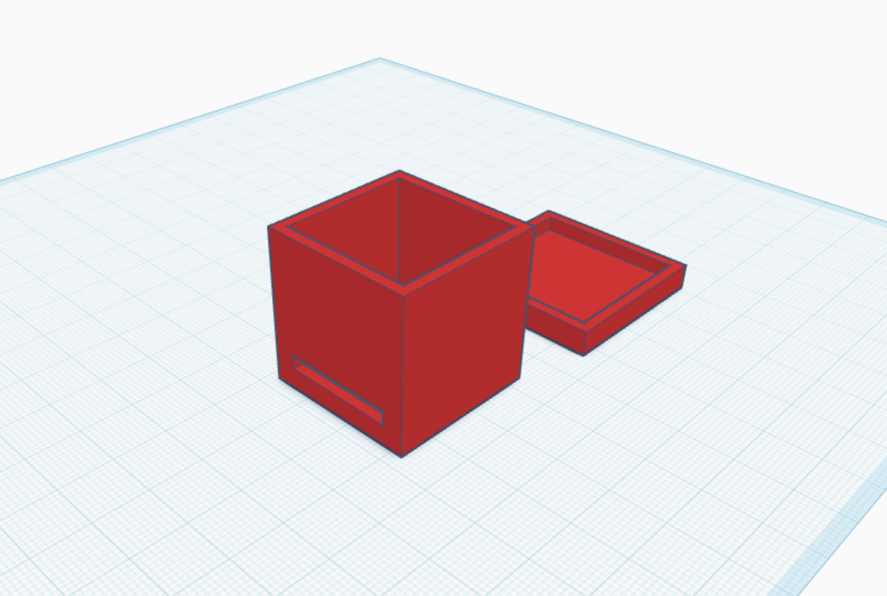
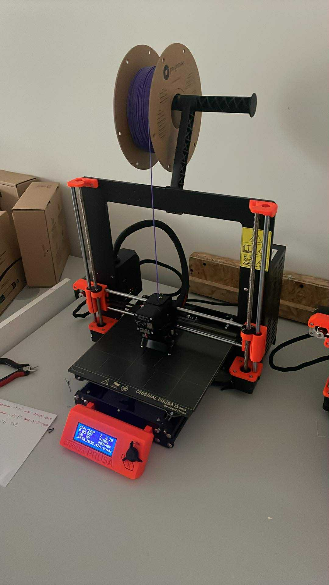
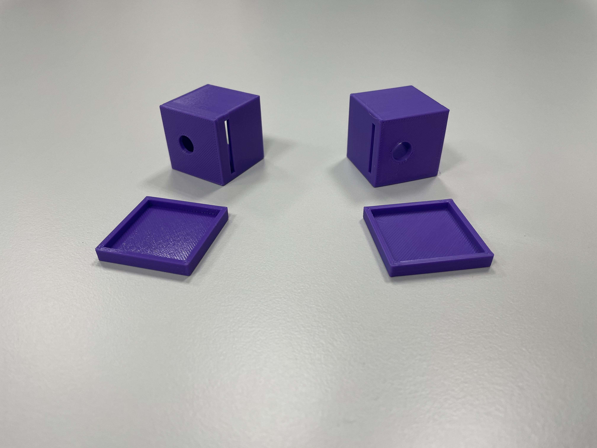
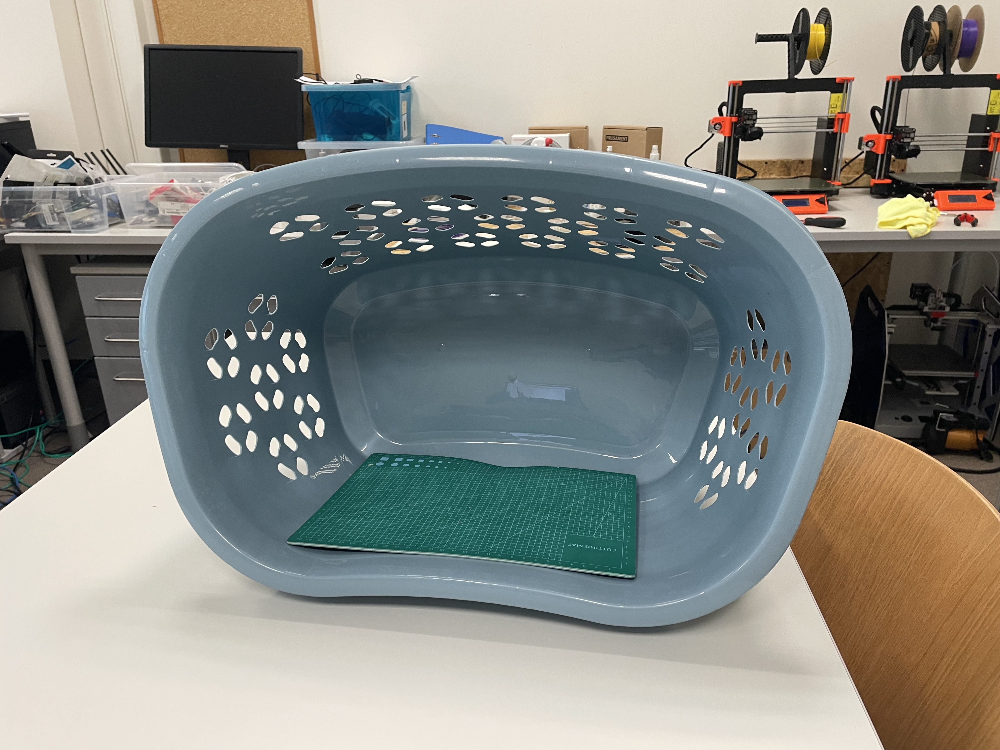
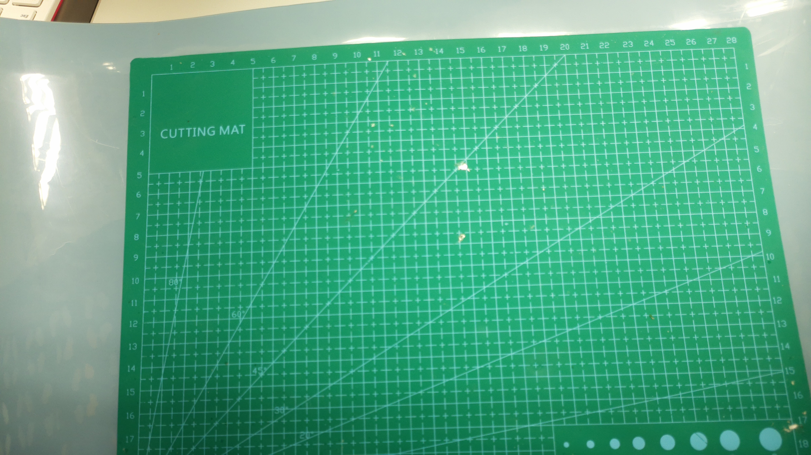
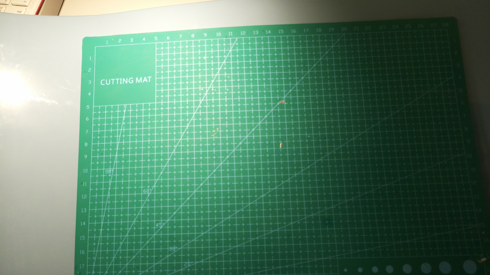
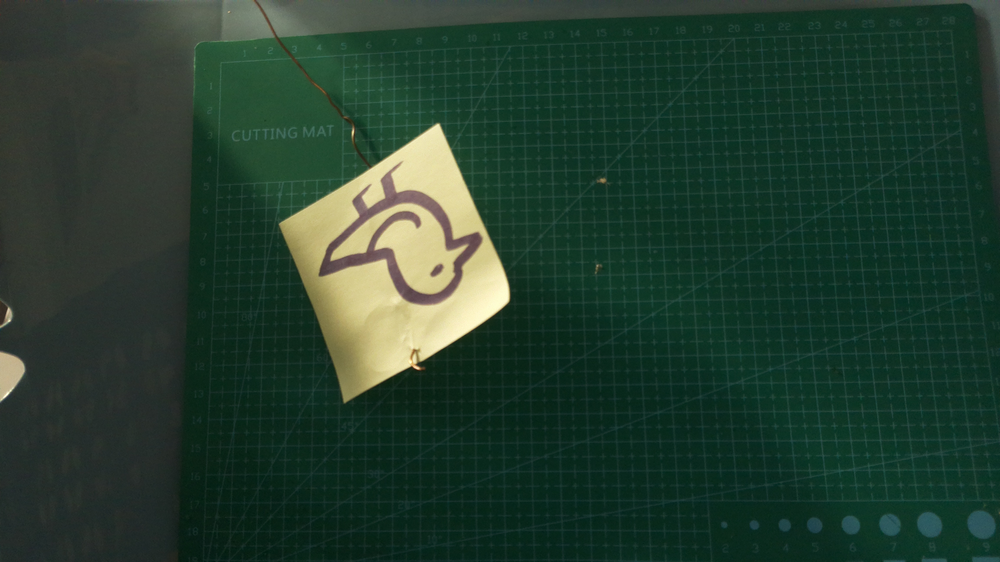
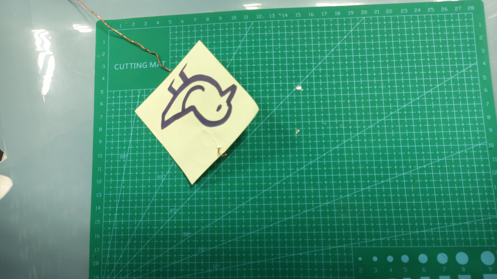

## Description of the project

We tried to re-create an automatic bird feeder from the article (https://habr.com/ru/articles/322520/) by Maltsev Anton, using Raspberry Pi.

## Construction

As a base for this project we used a plastic box for laundry (60x50x40 cm) as a base for bird feeder. At the top wall we decided to put a Raspberry Pi camera, covered in plastic coating for making it waterproof. We decided that Raspberry shouldn't be put outside, because the weather might be too harsh for the computer, so there is no waterproof coating for this component.

## Process of making the feeder

### Python enviroment
A bird-env environment was created and the following were installed:

> pip install opencv-python python-telegram-bot numpy
> In Makefile.config for Caffe, the paths to bird-env were specified.

### Caffe installation

> sudo apt install build - essential cmake git libatlas - base - dev libboost
> - all - dev \
> libgflags - dev libgoogle - glog - dev libhdf5 - dev libprotobuf - dev \
> libleveldb - dev liblmdb - dev libopencv - dev libsnappy - dev protobuf -
> compiler \
> python3 - dev python3 - numpy python3 - pip python3 - protobuf libopenblas -
> dev

Caffe was downloaded and configured

> git clone https :// github . com / BVLC / caffe . git
> cd caffe
> cp Makefile . config . example Makefile . config
> Edycja cieek do bird - env
> make all - j2
> make pycaffe

### Installation and modification of SqueezeNet
> cd ~/ caffe / models
> git clone https :// github . com / DeepScale / SqueezeNet . git
> cd SqueezeNet / S q u e e z e N e t _ v 1 .1
> wget https :// github . com / DeepScale / SqueezeNet / raw / master / S q u e e z e N e t _ v 1
> .1/ s q u e e z e n e t _ v 1 .1. caffemodel

### Modification of the output layer

The final layers in deploy.prototxt were changed to:

layer {
name : " conv10 "
type : " Convolution "
bottom : " fire9 / concat "
top : " conv10 "
c o n v o l u t i o n _ p a r a m {
num_output : 3
kernel_size : 1
stride : 1
w e i g h t _ f i l l e r {
type : " gaussian "
mean : 0.0
std : 0.01
}
bias_filler {
type : " constant "
value : 0
}
}
}
layer {
name : " relu_conv10 "
type : " ReLU "
bottom : " conv10 "
top : " conv10 "
}
layer {
name : " pool10 "
type : " Pooling "

bottom : " conv10 "
top : " pool10 "
p o o l i n g _ p a r a m {
pool : AVE
g l o b a l _ p o o l i n g : true
}
}
layer {
name : " prob "
type : " Softmax "
bottom : " pool10 "
top : " prob "
}

### 3D modeling of the coating

We have designed the coating for the camera. It is a hollow cube with external size 34x34x34mm and internal size 30x30x32mm with a window for the lens and a rectangular opening for the cable, which has to be additionally sealed with glue. 

 
 

There was a mistake in the first design, because the lens window was located improperly, so the second attempt was much better.

 

### Bird feeder base

We have chosen a plastic box for laundry (60x50x40 cm) as a base for the bird feeder, because it is heavy and big enough for our experiment. For more precise results we have decided to add a cutting mat infront of the camera, so the background is always the same.

 

### Raspberry Pi camera

We used an original Camera Module 3 with autofocus and a 12-megapixel sensor. 

### Issues with Raspberry Pi

There was a problem with the first Raspberry Pi computer, because due to unnown reasons, it stopped seeing the camera after a few attempts to capture enough photoes, so we had to switch to another Raspberry Pi computer. The fist computer stopped working at all, so we had to redo a part of the process, but some of the files were saved in a memory card.

### Preparing pictures

We made two directories "Train" and "Validation". Each one of them contains two groups of pictures "Bird" and "No bird". We needed to take pictures with different lighting and different positions of the "bird" (we used a paper sticker for the first draft, because it would take too much time to train tghe model on real birds. Of course, this draft can only find stickers, but we needed to understand caffe better for more complicated work).

### No bird
 
 
### Bird
 
 

The least demanding model needed around 120 pictures with birds and the same amount of pictures with no birds, so each one of the four repositories contains of 60 pictures.

 

## Results

Obviously, it is just a part of the bigger project. Sadly, we have not got enough time to finish it properly, because none of us has ever worked with caffe or anything related to AI, but the main factor was the broken Raspberry Pi, which destroyed a part of our work and made us start again. We learned many different things while doing this project, so it was a great way to understand how to construct more complicated systems like this.

## Sourses:
- (https://habr.com/ru/articles/322520/)
